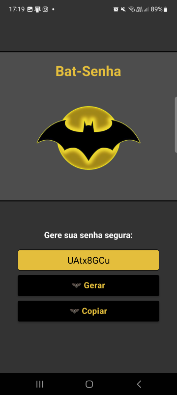

# 🦇 BAT-SENHA

Aplicativo desenvolvido em React Native juntamente com Expo simulando um gerador de senhas do Batman.


## 🚀 Ambiente de desenvolvimento

O código fonte se encontra no repositório do Github:

https://github.com/jeancrrg/Blog-Marvel-Angular.git

## 💻 Tecnologias utilizadas

>Html → Linguagem de marcação de Hipertexto

>Scss → Folha de estilo dos componentes

>Typescript → Linguagem de programação

>React Native 18.3.1 → Framework

>Node 20.15.1 → Framework

>Npm 10.7.0 → Gerenciador de pacotes do Node

## 📝 Requisitos

>Versão 18.3.1 do React Native

>Versão do Node compatível a versão do React Native

## 🛠️ Como rodar o projeto

Ao importar o projeto, antes de subir localmente é necessário instalar as bibliotecas do projeto, para isso basta executar o seguinte comando no terminal:

```properties
npm install
```

Logo após a instalação das bibliotecas basta executar o seguinte comando para subir localmente:

```properties
npm run start
```

## 📌 Sobre o aplicativo

O aplicativo foi desenvolvido para gerar senhas seguras a fim de utilizar como acesso a outras aplicações de forma totalmente segura. Com isso possui a funcionalidade de gerar uma senha segura e também copiá-las.


